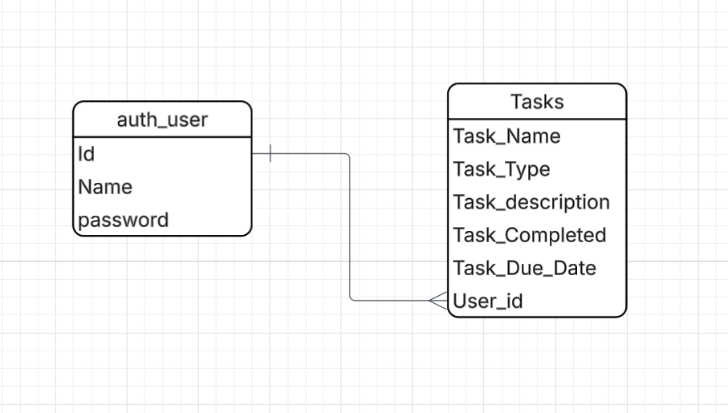

#  Task Manager App

**Task Manager** is a simple and responsive to-do list web application built with **Django**.  
It allows users to **create, update, and delete tasks**, and mark them as completed.  
Each user has their own account and can log in to manage their personal list of tasks.  

The main goal of this project was to practice **full-stack development** using Django — combining backend logic with front-end styling and user authentication.

##  Getting Started

###  Live App
👉 [Visit the deployed app here](https://link.com)

### 🧱 Planning Materials
- **ERD:** 

## User Stories

As a user, I want to log in to my account so that I can securely access my personal tasks.

As a user, I want to log out of my account so that I can protect my information when I’m done using the app.

As a user, I want to add new tasks so that I can keep track of what I need to do.

As a user, I want to view all my tasks so that I can see what’s pending or completed.

As a user, I want to edit my tasks so that I can update details such as the name, description, or due date.

As a user, I want to delete tasks so that I can remove tasks that are no longer needed

##  Screenshots

### Task List Page

### Task Details

---

##  Technologies Used

- **Python**
- **Django** 
- **HTML** 
- **CSS**
- **Git & GitHub** 

---

##  Lessons Learned

This project helped me:
- Understand Django’s **Model-View-Template (MVT)** structure.
- Work with **user authentication** and **CSRF protection**.
- Improve my skills in **responsive CSS design** and styling Django forms.
- Learn the importance of version control and deployment workflow.

---

##  Next Steps

Planned future enhancements:
- Add a **search and filter** feature for tasks.
- Implement **task categories** or priorities.
- Allow users to **set reminders or notifications**.
- Add **dark mode** toggle for better UX.

---

##  Author

Developed by **[Ahmad Qudah]**  
📧 Email: [ahmadqudah2312@gmail.com]  
